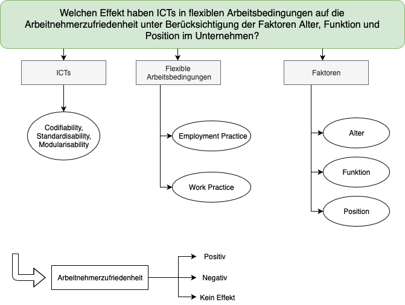

# Arbeitszufriedenheit durch Telework

### Teammitglieder

* Laura Skowronek
* Katja Kever
* Alica Kraus
* Katharina Lehmeier
* Jiani Huang

#### Forschungsfrage und Faktorenraum
_Welchen Einfluss haben Nutzerfaktoren auf durch Telework erzeugte
Arbeitszufriedenheit?_

Durch unserer Forschungsfrage möchten wir herausstellen welchen Einfluss die Nutzerfaktoren sowie die Faktoren commitment und involvement auf die Arbeitszufriedenheit haben.

#### _Frühere Version_

### Unterschiedshypothesen

H: Mitarbeiter aus der jüngeren Altersgruppe mit flexiblen Arbeitsbedingungen, weisen eine höhere Arbeitszufriedenheit auf.

H0: Es macht keinen Unterschied bei der Arbeitszufriedenheit, ob die Mitarbeiter der jüngeren oder älteren Altersgruppe angehören. 

H1: Es macht einen Unterschied bei der Arbeitszufriedenheit, ob die Mitarbeiter der jüngeren oder älteren Altersgruppe angehören. 

Verfahren: T-Test

H: Mitarbeiter im IT-Bereich haben eine höhere Arbeitszufriedenheit durch flexible Arbeitsbedingungen als Mitarbeiter aus anderen Bereichen. 

H0: Es gibt keinen Unterschied bei der Arbeitszufriedenheit zwischen den Mitarbeitern aus unterschiedlichen Bereichen.

H1: Es gibt einen Unterschied bei der Arbeitszufriedenheit zwischen den Mitarbeitern aus unterschiedlichen Bereichen.

Verfahren: T-Test

H: Es gibt eine höhere Arbeitszufriedenheit durch Telework, je nach Jobposition. 

H0: Es macht keinen Unterschied bei der durch Telework erzeugten Arbeitzufriedenheit, in welcher Jobposition Mitarbeiter tätig sind. 

H1: Es macht einen Unterschied bei der durch Telework erzeugten Arbeitzufriedenheit, in welcher Jobposition Mitarbeiter tätig sind. 

Verfahren: ANOVA

H: Es gibt eine höhere Arbeitszufrieden durch Telework, je nach Altersgruppe, Funktion und Position.

H0: Durch Telework erzeugte Arbeitszufriedenheit ist unabhängig von Altersgruppe, Funktion und Position. 

H1: Durch Telework erzeugte Arbeitszufriedenheit ist abhängig von Altersgruppe, Funktion und Position.

Verfahren: Dreifaktorielle ANOVA

H: Mitarbeiter, die ihre Arbeitsstrukturen selbst einteilen können, haben eine höhere Arbeitszufriedenheit.

H0: Es macht keinen Unterschied bei der Arbeitszufriedenheit, ob der Mitarbeiter seine Arbeitsstrukturen selbst einteilt oder diese vom Arbeitgeber vorgegeben werden. 

H1: Es macht einen Unterschied bei der Arbeitszufriedenheit, ob der Mitarbeiter seine Arbeitsstrukturen selbst einteilt oder diese vom Arbeitgeber vorgegeben werden. 

Verfahren: T-Test

## Zusammenhangshypothese

H: Nutzerfreundliche ICTs verhelfen bei Telework zu einer höheren Arbeitszufriedenheit.

H0: Die Nutzerfreundlichkeit der ICTs bei Telework erzeugt keinen Unterschied bei der  Arbeitszufriedenheit.

H1: Die Nutzerfreundlichkeit der ICTs bei Telework evoziert einen Unterschied bei der Arbeitszufriedenheit.

Verfahren: Korrelation

H: Es gibt einen negativen Zusammenhang zwischen dem Alter und der Arbeitszufriedenheit bei flexiblen Arbeitsbedingungen.

H0: Es gibt keinen Zusammenhang zwischen dem Alter und der Arbeitszufriedenheit bei flexiblen Arbeitsbedingungen.

Verfahren: Korrelation

H: Es gibt einen Zusammenhang zwischen dem Berufsfeld und der Arbeitszufriedenheit bei Telework.

H0: Es gibt keinen Zusammenhang zwischen dem Berufsfeld und der Arbeitszufriedenheit bei Telework.

Verfahren: Korrelation

H: Arbeitszufriedenheit bei Telework ist abhängig von nutzerfreundlichen ICTs und der Jobposition.

H0: Arbeitszufriedenheit bei Telework ist unabhängig von nutzerfreundlichen ICTs und der Jobposition.

Verfahren: Regression

H: Es gibt einen positiven Zusammenhang zwischen nutzerfreundlichen ICTs und der Arbeitszufriedenheit bei flexiblen Arbeitsbedingungen. 

H0: Es gibt keinen Zusammenhang zwischen nutzerfreundlichen ICTs und der Arbeitszufriedenheit bei flexiblen Arbeitsbedingungen. 

Verfahren: Korrelation

