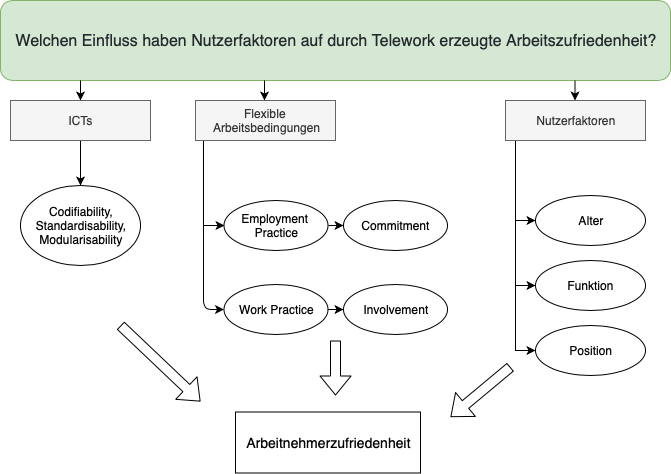

```{r setup, include=FALSE}
knitr::opts_chunk$set(echo = TRUE)
```

#### Teammitglieder
Laura Skowronek, Katja Kever, Alica Kraus, Katharina Lehmeier

#### 1. Forschungsfrage
Welchen Einfluss haben Nutzerfaktoren auf durch Telework erzeugte Arbeitszufriedenheit?


#### 2. Faktorenraum
